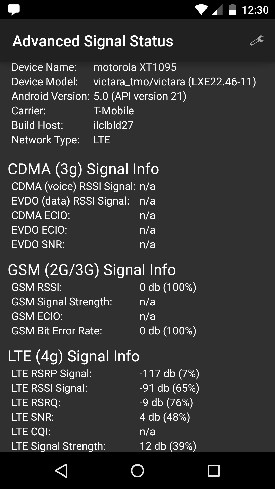

# Advanced Signal Status

* Language Used: ~~Java~~ Scala
* Requires: Android 2.3+
* License: MIT



## NOTE

Contacting me without reading the BUILDING file first will result in being ignored. Especially if it's about building the project in any IDE other than Intellij IDEA (especially Eclipse).

## Summary
Gives you all the available information for the CMDA/GSM/LTE Signal on your
Android Device. Not all information may be available depending on the OEM/OS
version of the device. I don't consider all of the code to be entirely "idiomatic Scala" due to performance considerations on Android
and also time needed to refine the code to be less "Java like."

However, the code is still more concise and I give some examples of how to cut down on some of the Java noise by using techniques such as using enrich/extension (a.k.a. "Pimp my Library") methods for ridiculous Java Boilerplate:

```scala
implicit class PimpMyTextView(val view: TextView) extends AnyVal {
  def text(txt: CharSequence): TextView = {
    view.setText(txt)
    view
  }

  def text(txtId: Int): TextView = {
    view.setText(txtId)
    view
  }
}

// usage below:
this.find[TextView](R.id.carrierName).text(Tm.getNetworkOperatorName)
this.find[TextView](R.id.buildHost).text(Build.HOST)
```

## Contributing

I do accept pull requests if you ask nicely. Also translations to other languages
are welcomed if you want to commit the files to me replacing the strings. All
strings for the user interface are abstracted out of the design, so easy to change.

Anyone interested in translating, create an account at [Transifex](https://www.transifex.com/projects/p/advanced-signal-info/).
From the project I created there, you can see what needs translated and if you add it there, I can automatically synchronize it to the codebase here. If the language you wish to translate to is not listed, just let me know and I can add it.

## Building

See the [building file](building.md) for assistance.

## Roadmap

To see what I'm working on or will be adding soon, look at the [roadmap file](roadmap.md)

## Downloading

The latest stable version of the app can be found on the [Android Market](https://play.google.com/store/apps/details?id=com.cc.signalinfo)

<a rel="nofollow" target="_blank" href="https://play.google.com/store/apps/details?id=com.cc.signalinfo">
    </img>
</a>

Sometimes I will update it in the repo here under the root, but don't count on it being up to date or stable.